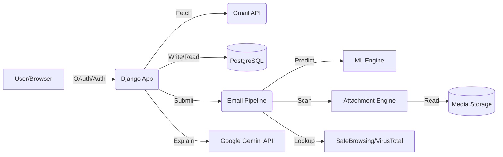
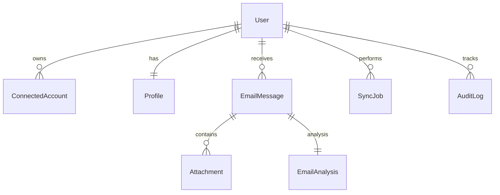
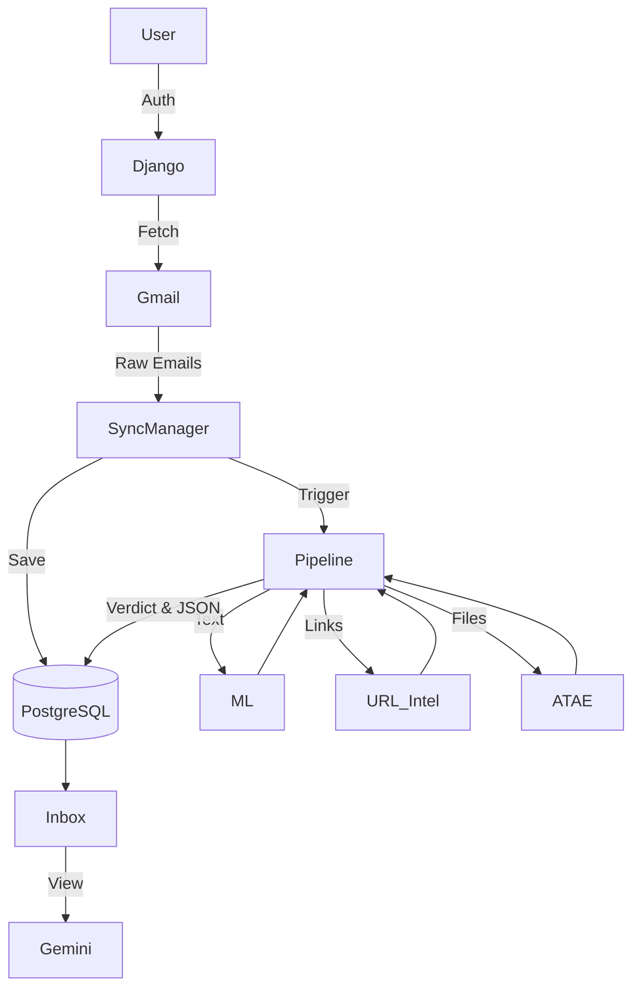
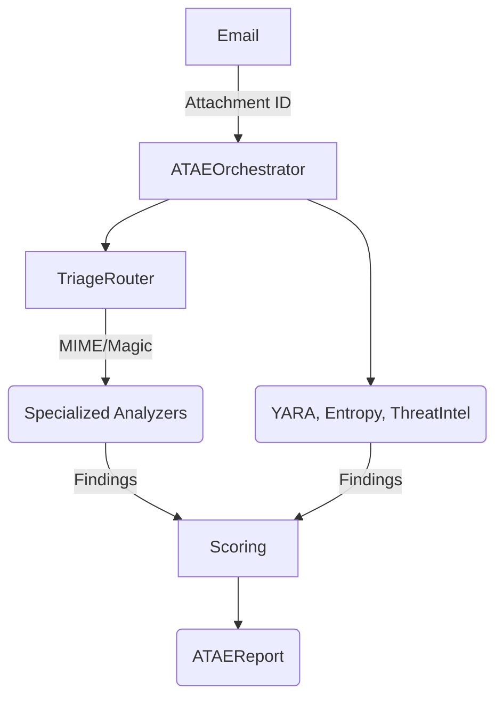

# SecureMail — Complete Technical Architecture & Working

## 1. PROJECT OVERVIEW
SecureMail is a Django-based cybersecurity SaaS web application that provides advanced email threat detection and forensic analysis. Its primary purpose is to automatically ingest, analyze, and explain security threats found in users' emails.

- **Backend**: Python 3.14 / Django 6.0.7
- **Frontend**: Django Templates, Tailwind CSS, JavaScript (AJAX/Fetch)
- **Database**: PostgreSQL
- **Gmail Integration**: Google OAuth 2.0 and Gmail API
- **Security Analysis**: Custom `EmailPipeline` combining heuristics, ML, URL threat intel, and Attachment scanning.
- **ML**: Offline-trained Random Forest models (`model.joblib`, `vectorizer.joblib`) deployed natively for text/header classification.
- **Attachment Analysis**: Attachment Threat Analysis Engine (ATAE) for in-depth, non-execution file forensics.
- **External Services**: VirusTotal, Google Safe Browsing, Google Gemini.
- **Overall Architecture**: Monolithic Django application with asynchronous processing handled via native Python daemon threads.



## 2. PROJECT ARCHITECTURE
The system is divided into several monolithic layers:
- **Frontend Layer**: Django views rendering templates.
- **Service Layer**: Houses `SyncManager`, `EmailPipeline`, `GeminiService`, encapsulating core business logic outside of views.
- **ML Layer**: Independent Python modules performing inference on email content.
- **ATAE Layer**: Highly modular framework within the service layer handling deep file inspection.
- **Data Layer**: PostgreSQL managing persistent models (`EmailMessage`, `Attachment`, `EmailAnalysis`).

**Flow**:
Browser → Views (Django) → Services (`SyncManager`/`EmailPipeline`) → Engines (ML/ATAE) → Database (PostgreSQL) → Views (Dashboard/Inbox).

## 3. PROJECT STRUCTURE
```
SecureMail/
    models.py             # Defines DB schema (Profile, EmailMessage, Attachment, etc.)
    views.py              # Main UI controllers (inbox, dashboard, detail, mail actions)
    api_views.py          # API endpoints for AJAX calls
    google_auth_views.py  # OAuth 2.0 flow, token generation and revocation
    utils.py              # Security utilities (e.g., safe_redirect)
    services/
        email_pipeline.py # Orchestrates ML + URL + ATAE analysis
        sync_manager.py   # Background Gmail fetching
        gemini_service.py # Gemini API wrapper for explanation generation
        atae/             # Attachment Threat Analysis Engine
            integration/  # Orchestrator and bootstrapping
            triage/       # Magic bytes and MIME detection
            analyzers/    # Format-specific parsers (PDF, Office, Scripts, etc.)
            services/     # YARA, Entropy, IoC scanning
        pdf/              # Forensic PDF generation using ReportLab
    ml/                   # Predictor classes and Joblib models
    tasks/                # Native threading background tasks mimicking Celery APIs
    templates/            # HTML/Tailwind frontend files
```

## 4. DATABASE ARCHITECTURE
**ACTIVE DATABASE**: PostgreSQL (Configured via `django.db.backends.postgresql`).

Important Models:
- `Profile`: One-to-one with User. Stores timezone, alert preferences, and tracking pixel blocks.
- `ConnectedAccount`: Stores `access_token` and `refresh_token` (encrypted) and `history_id` for Gmail delta syncs.
- `EmailMessage`: Core record. Fields: `subject`, `sender_email`, `folder`, `risk_score`, `ml_label`, `in_trash`. Created by `SyncManager`, updated by `EmailPipeline` and user actions.
- `Attachment`: Belongs to `EmailMessage`. Stores `file` path, `mime_type`, `scan_status`, `md5`, `sha256`. Created by `SyncManager`, scanned by `ATAE`.
- `EmailAnalysis`: Stores the comprehensive JSON forensic report. Related to `EmailMessage`. Created by `EmailPipeline`.
- `SyncJob`: Tracks sync states (`status`, `full_sync`). Created by `SyncManager`.
- `AuditLog`: Immutable log tracking sensitive actions (`user`, `action`, `ip_address`).



## 5. AUTHENTICATION SYSTEM
SecureMail uses Django's native authentication supplemented by custom `@rate_limit_view` decorators to prevent brute-force attacks.
- **Flow**: User inputs credentials → `login_view` validates and logs in → Session cookie is set → Subsequent requests enforce `@login_required`.
- **Security**: Passwords use Django's strong hashers (PBKDF2). CSRF tokens validate all POSTs. Rate limiting restricts attempts (e.g., 5 per minute).

## 6. GOOGLE OAUTH & GMAIL CONNECTION
- **Flow**: User clicks "Connect Gmail" → `google_login()` sets PKCE `code_verifier` and `state` in session, redirects to Google → User consents → `google_callback()` validates `state`, exchanges `code` for tokens.
- **Storage**: Tokens are saved to `ConnectedAccount`. **Tokens are encrypted at rest** using `django-encrypted-model-fields` with a 32-byte `FIELD_ENCRYPTION_KEY`.
- **Disconnection**: `google_disconnect()` calls Google's revocation API synchronously and deletes the `ConnectedAccount`.

## 7. EMAIL SYNCHRONIZATION
**Flow**: 
User Action → `sync_gmail()` view → `SyncManager.start_sync()` → `SyncJob` created (RUNNING) → `sync_emails_background` daemon thread started.
- In thread: `SyncManager` uses `gmail_service.get_messages()` with `historyId` logic to fetch delta changes or full mailbox.
- **Parsing**: Gmail payloads are traversed. Headers (Subject, From), Body (HTML/Plain), and Attachments are extracted.
- **Persistence**: Saved as `EmailMessage` and `Attachment`.
- **Analysis Trigger**: The thread calls `analyze_attachment_task.delay(new_att.id)`, which spins up another thread to run the `EmailPipeline`.

## 8. COMPLETE EMAIL LIFECYCLE
1. **Gmail**: Email arrives in user's Gmail.
2. **Fetch**: `SyncManager` thread retrieves it via Google API.
3. **Store**: Persisted to PostgreSQL (`EmailMessage`) and filesystem (`media/`).
4. **Analyze**: `EmailPipeline` is triggered via `ATAETask.delay`. It passes email data to `ml.Predictor`.
5. **URL**: Links are extracted and queried against SafeBrowsing/VirusTotal.
6. **Attachment**: `ATAEOrchestrator` scans the file on disk, producing an `ATAEReport`.
7. **Verdict**: Pipeline aggregates ML, URL, and ATAE scores to assign a `risk_score` (0-100) and `ml_label`.
8. **UI**: User views the `inbox()` view, seeing the email categorized by its risk label.

## 9. EMAIL SECURITY ANALYSIS PIPELINE
**Implementation**: `SecureMail/services/email_pipeline.py -> EmailPipeline.run()`.
1. **Input**: `EmailMessage` ID.
2. **Feature Extraction**: Extracts text, headers.
3. **Machine Learning**: Passes features to `Predictor`.
4. **URL Analysis**: Checks links sequentially.
5. **Attachment Analysis**: Invokes ATAE for all attachments.
6. **Aggregation**: Calculates final risk.
7. **Storage**: Saves `EmailAnalysis` JSON blob.

## 10. MACHINE LEARNING ENGINE
- **Implementation**: `SecureMail/ml/predictor.py`.
- **Models**: Pre-trained Random Forest and TF-IDF vectors loaded via `joblib` from `SecureMail/ml/` at runtime.
- **Flow**: Pipeline provides raw text → `Predictor` extracts features → applies TF-IDF → model infers → returns `prediction` (SAFE/PHISHING) and `confidence` percentage.
- **Integration**: Results are immediately factored into the overarching risk score in the pipeline.

## 11. URL / LINK ANALYSIS
- **Flow**: `EmailPipeline` extracts `<a href>` and plain text URLs via regex/BeautifulSoup.
- **External Apis**: URLs are sent synchronously to `VirusTotalService` and `SafeBrowsingService`.
- **Failure Behavior**: If APIs timeout or fail, the pipeline catches `requests.RequestException`, assigns an UNKNOWN status to the link, logs the error, and proceeds (fail-open to avoid pipeline halts).

## 12. ATTACHMENT SYSTEM
- **Retrieval**: Fetched during `SyncManager` processing using the Gmail API `attachments.get`.
- **Storage**: Saved directly to `MEDIA_ROOT/attachments/<id>_filename`.
- **Tracking**: `Attachment` model stores MD5/SHA256 calculated upon save, and `scan_status` (PENDING, COMPLETED, FAILED).

## 13. ATTACHMENT THREAT ANALYSIS ENGINE — ATAE
**CRITICAL PROJECT RULE**: ATAE analyzes ONLY attachments originating from emails inside SecureMail. There is NO arbitrary file upload endpoint.
- **Entry Point**: `ATAEOrchestrator.analyze_attachment()`.
- **Triage**: `TriageRouter` reads magic bytes, determines file type.
- **Services**: `EntropyService` (detects packing), `YARAService` (scans against custom rules), `MetadataService`, `ThreatIntelService` (queries VT hash).
- **Analyzers**:
  - `ArchiveAnalyzer`: Lists contents of ZIP/RAR.
  - `ExecutableAnalyzer`: Inspects PE sections, imports.
  - `OfficeAnalyzer`: Checks for macros and embedded OLE.
  - `PDFAnalyzer`: Inspects for JavaScript and Launch actions.
  - `ScriptAnalyzer`: Checks JS/VBS/PS1 for obfuscation patterns.
  - `ImageAnalyzer`: Analyzes EXIF and visual anomalies.

## 14. ATAE RISK SCORING
- **Scoring**: Inside `ATAEOrchestrator._calculate_risk()`.
- **Logic**: Base score begins at 0. Findings from analyzers and services carry varying severity weights (e.g., Critical +50, High +30, Medium +15, Low +5).
- **Thresholds**: Total score determines risk:
  - Score >= 70: MALICIOUS
  - Score >= 30: SUSPICIOUS
  - Score < 30: SAFE

## 15. FINAL EMAIL RISK CALCULATION
- **Implementation**: `EmailPipeline._calculate_overall_risk()`.
- **Signals Combined**: 
  - ML Prediction (`PHISHING` heavily increases score, `SAFE` reduces).
  - URL Risk (Malicious links contribute high risk).
  - ATAE Risk (The highest attachment risk score is incorporated).
- **Labels**:
  - `risk_score >= 70` → PHISHING
  - `risk_score >= 30` → SUSPICIOUS
  - `risk_score < 30` → SAFE
  (Emails are categorized directly by these thresholds).

## 16. GEMINI / AI SYSTEM
- **Implementation**: `SecureMail/services/gemini_service.py` using `google.genai` SDK.
- **Role**: **EXPLANATION ONLY**, not detection. The system has already determined the risk score and label.
- **Flow**: User clicks "Explain" → AJAX calls `generate_explanation()` view → Synchronously builds a prompt containing ML, URL, and ATAE findings → Queries Gemini Flash model → Parses JSON response.
- **Resilience**: Features `max_retries=2`, catches timeouts, and falls back to a deterministic explanation if the API fails.
- **Storage**: Appends `gemini_explanation` to the `EmailAnalysis` JSON payload to cache the result.

## 17. DASHBOARD
- **Implementation**: `dashboard()` view in `views.py`.
- **Queries**: Relies on optimized PostgreSQL single-aggregation queries (`.count()`) to calculate total emails, threats detected (where `risk_score >= 30`), and pending syncs.
- **UI**: Renders Tailwind charts and metrics without N+1 query iteration loops.

## 18. INBOX
- **Implementation**: `inbox()` view in `views.py`.
- **Filtering**: Filters `EmailMessage` by `request.user` and the selected `folder` (e.g., 'Phishing', 'Starred', 'Trash').
- **Pagination**: Implemented natively using Django `Paginator` (25 per page).
- **Rendering**: Templates display the risk label prominently with corresponding color-coding.

## 19. EMAIL DETAIL VIEW
- **Implementation**: `email_view()` in `views.py`.
- **Flow**: Validates ownership (`user=request.user`) → Retrieves `EmailMessage` and `EmailAnalysis` → Unpacks JSON analysis data (ML, Links, ATAE findings) → Checks for Tracking Pixels → Renders HTML template. The template applies the `e()` DOM XSS guard around dynamic AI strings.

## 20. ATTACHMENT PREVIEW & DOWNLOAD
- **Implementation**: `download_attachment()` and `preview_attachment()` in `views.py`.
- **Flow**: Ownership verified via `EmailMessage.user`.
- **Preview**: Determines safe MIME types (images, pdfs, text) and streams them using `FileResponse`. Dangerous files (executables) are strictly served with `Content-Disposition: attachment` (forced download).

## 21. PROFILE SYSTEM
- **Implementation**: `Profile` model and `profile_view()`.
- **Features**: Timezone setting, weekly alert toggles, and tracking pixel blocking toggle.
- **Audit**: Renders recent `AuditLog` events (e.g., login, delete_email) for user transparency.

## 22. REPORTING
- **Implementation**: `SecureMail/services/pdf/forensic_report.py`.
- **Flow**: User requests PDF → `export_pdf()` view → `ForensicReportGenerator.generate()` → Uses ReportLab to draw canvas with layout, sections, and findings → Returns `FileResponse` containing the generated PDF stream.

## 23. FRONTEND ARCHITECTURE
- **Technologies**: Django Templates extending `base.html`, Tailwind CSS utility classes, Lucide Icons, vanilla JavaScript.
- **Dynamic Content**: Most content is server-rendered. Dynamic interactions (Starring, Gemini Generation, Manual Sync) use vanilla JS `fetch()` AJAX calls handling CSRF tokens securely.

## 24. API / ENDPOINT ARCHITECTURE
| METHOD | URL | VIEW | PURPOSE | AUTH |
|---|---|---|---|---|
| POST | `/sync/` | `sync_gmail` | Start background sync | User, CSRF |
| POST | `/email/<id>/delete/` | `delete_email` | Move to trash / Delete | User, CSRF |
| POST | `/email/<id>/star/` | `toggle_star` | Toggle starred status | User, CSRF |
| GET | `/email/<id>/generate-explanation/` | `generate_explanation` | Trigger Gemini explanation | User |
| GET | `/email/<id>/export-pdf/` | `export_pdf` | Generate forensic PDF | User |
| GET | `/attachment/<id>/download/` | `download_attachment` | Download attachment | User |

## 25. SECURITY ARCHITECTURE
- **Authentication**: Native Django with PBKDF2 hashing.
- **Authorization**: Hardcoded `user=request.user` limits on all ORM queries.
- **CSRF**: Enforced globally. Sensitive endpoints strictly use `@require_POST`.
- **Rate Limiting**: `@rate_limit_view` blocks brute force on `/login`, `/register`, and OAuth callbacks.
- **Open Redirect**: `safe_redirect()` uses Django's `url_has_allowed_host_and_scheme`.
- **Token Encryption**: `django-encrypted-model-fields` protects OAuth tokens.
- **XSS Protections**: `e()` vanilla JS escaper implemented in templates for safe DOM insertion of Gemini JSON outputs.

## 26. LOGGING & AUDIT
- **Application Logging**: Python's `logging` module logs state changes and latencies. Sensitives (tokens, passwords, email bodies) are intentionally omitted.
- **AuditLog**: Database-backed audit trail for user actions, visible in the Profile view.

## 27. EXTERNAL SERVICES
| SERVICE | WHY USED | CALLED FROM | FAILURE BEHAVIOR |
|---|---|---|---|
| Gmail API | Fetch emails/attachments | `SyncManager` | Halts specific sync job |
| Google OAuth | Identity / Token generation | `google_auth_views.py` | Denies login |
| VirusTotal | URL / Hash threat intel | `VirusTotalService` | Fails open, logs warning |
| Safe Browsing | URL threat intel | `SafeBrowsingService` | Fails open, logs warning |
| Gemini | Threat explanations | `GeminiService` | Falls back to deterministic text |

## 28. SYNCHRONOUS / ASYNCHRONOUS EXECUTION
- **Synchronous**: Web views, API callbacks, Database reads/writes, Gemini API generation, URL Analysis API lookups, PDF generation.
- **Asynchronous**: Gmail Synchronization and Email Pipeline (ML + ATAE). These are executed via background native Python `threading.Thread(daemon=True)`.
*Note*: Celery, Redis, Huey, and Django-Q are **NOT** currently implemented.

## 29. SETTINGS & ENVIRONMENT
- **Environment Variables Required**: `SECRET_KEY`, `DEBUG`, `ALLOWED_HOSTS`, `GOOGLE_API_KEY`, `GEMINI_API_KEY`, `SAFE_BROWSING_API_KEY`, `VIRUSTOTAL_API_KEY`, `GOOGLE_CLIENT_ID`, `GOOGLE_CLIENT_SECRET`, `DB_NAME`, `DB_USER`, `DB_PASSWORD`, `DB_HOST`, `DB_PORT`, `FIELD_ENCRYPTION_KEY`.
- **Security**: When `DEBUG=False` (Production), Django enables secure cookies, SSL redirects, and HSTS automatically.
- **Cache**: Currently using `LocMemCache`.

## 30. DEPENDENCIES
- `Django`: Web framework.
- `psycopg2-binary`: PostgreSQL adapter.
- `google-auth`, `google-api-python-client`: OAuth and Gmail.
- `google-genai`: Gemini API.
- `scikit-learn`: ML inference.
- `django-encrypted-model-fields`: Token security at rest.
- `reportlab`: PDF generation.
- `yara-python`: ATAE YARA scanning.

## 31. TESTING
- **Architecture**: Standard Django `TestCase` leveraging mocked APIs (`patch`).
- **Coverage**: 83 tests verified passing covering ML loading, ATAE integration, CSRF validation, Redirect validation, OAuth mock flows, and Pipeline scoring logic.

## 32. COMPLETE DATA FLOW


## 33. COMPLETE CALL FLOW
`sync_gmail()` -> `SyncManager.start_sync()` -> `(Thread)` -> `gmail_service.get_messages()` -> `EmailMessage.save()` -> `analyze_attachment_task.delay()` -> `(Thread)` -> `EmailPipeline.run()` -> `ML.Predict()` + `ATAE.analyze()` -> `EmailAnalysis.save()`.

## 34. COMPLETE ATAE FLOW


## 35. REAL END-TO-END EXAMPLES
- **Phishing Detection**: Email synced -> Pipeline triggered -> ML detects keyword heuristics -> ATAE detects Office VBA macro via `OfficeAnalyzer` -> Score hits 85 -> Labeled PHISHING -> Saved to DB -> Displayed in Inbox -> User clicks Explain -> Gemini summarizes macro risk.

## 36. COMPONENT RESPONSIBILITY MATRIX
| COMPONENT | RESPONSIBILITY | CALLED BY | CALLS | STORES DATA? |
|---|---|---|---|---|
| `SyncManager` | Fetching Gmail | `views.py` | `gmail_service`, `DB` | YES |
| `EmailPipeline` | Security Analysis | `SyncManager` | `ML`, `ATAE`, `URL_APIs` | YES |
| `ATAE` | Deep File Scan | `EmailPipeline` | `Triage`, `Analyzers` | NO |
| `GeminiService`| AI Explanations | `views.py` | Gemini API | NO |

## 37. WHAT IS IMPLEMENTED VS NOT IMPLEMENTED
- **IMPLEMENTED AND ACTIVE**: Google OAuth, Gmail Sync, ML Analysis, ATAE Attachment Analysis, Gemini Explanations, PostgreSQL, Forensic PDFs.
- **IMPLEMENTED BUT NOT IN ACTIVE FLOW**: Microsoft OAuth (Optional code present but commented in `.env.example`).
- **DOCUMENTED/PLANNED BUT NOT IMPLEMENTED**: Celery/Redis background task queues (currently using native threading), CSV export functionalities (intentionally removed).

## 38. FINAL MASTER FLOW
USER
↓
GOOGLE OAUTH
↓
GMAIL CONNECTION
↓
EMAIL SYNC (Background Threading)
↓
PARSING
↓
POSTGRESQL DATABASE
↓
SECURITY ANALYSIS PIPELINE
↓
ML / URL / ATAE
↓
RISK DECISION
↓
DATABASE UPDATE
↓
DASHBOARD / INBOX
↓
EMAIL DETAIL
↓
AI EXPLANATION (Synchronous Fetch)
