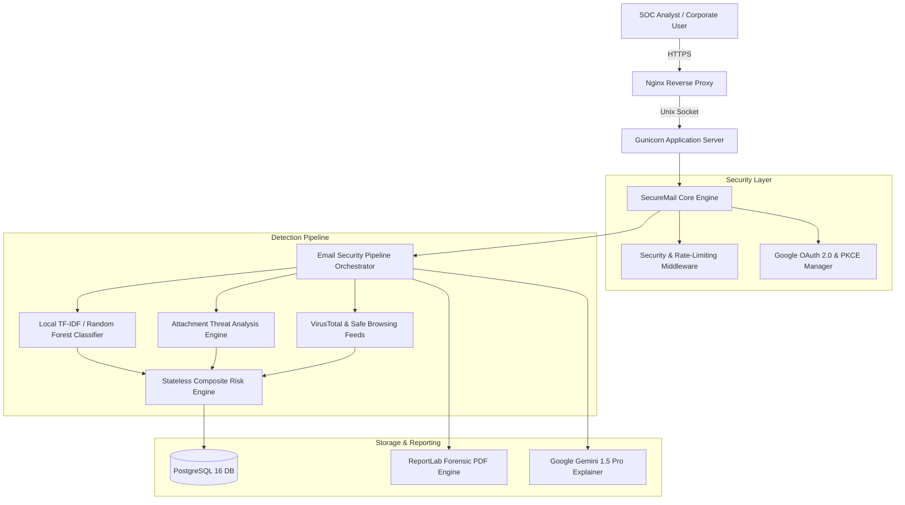
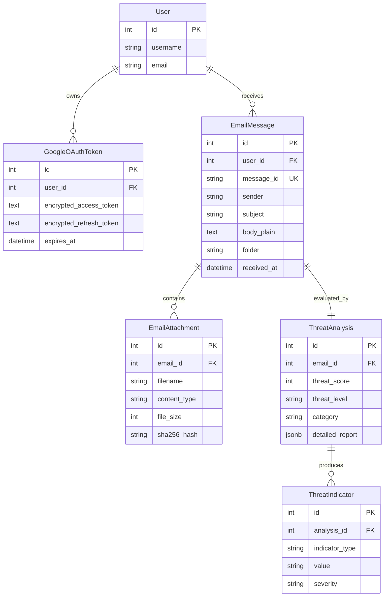

# SECUREMAIL: ENTERPRISE SOFTWARE DESIGN DOCUMENT & SYSTEM SPECIFICATION
**System Version**: 1.0.0-PROD  
**Document Classification**: Enterprise Architecture / Technical Portfolio Reference  
**Last Revised**: August 2026  

---

## Version History

| Version | Date | Author / Team | Description |
| :--- | :--- | :--- | :--- |
| **1.0.0-DEV** | 2026-07-25 | Core Engineering | Initial architecture, Django data models, and OAuth 2.0 flow. |
| **1.0.0-RC1** | 2026-07-30 | Security & Detection | Machine Learning pipeline and ATAE static forensic sandbox. |
| **1.0.0-OPT** | 2026-08-01 | Performance Engineering | Elimination of ORM N+1 query loops; DB prefetch optimization. |
| **1.0.0-PROD**| 2026-08-02 | Production Audit Team | 8-phase Locust validation, 30-min soak test, and production certification. |

---

## Table of Contents
1. [Abstract](#1-abstract)
2. [Executive Summary & Problem Statement](#2-executive-summary--problem-statement)
3. [Technology Stack & System Specifications](#3-technology-stack--system-specifications)
4. [High-Level & Component Architecture](#4-high-level--component-architecture)
5. [Database Architecture & Entity Relationships](#5-database-architecture--entity-relationships)
6. [Authentication, Authorization & Security Architecture](#6-authentication-authorization--security-architecture)
7. [Detection Subsystems (ML, ATAE, Threat Intel, Risk Engine)](#7-detection-subsystems)
8. [REST API & Core Endpoint Reference](#8-rest-api--core-endpoint-reference)
9. [Performance Engineering & N+1 Optimization History](#9-performance-engineering--n1-optimization-history)
10. [Comprehensive Validation & Load Testing (Phases 1 – 8)](#10-comprehensive-validation--load-testing)
11. [Production Deployment & Infrastructure Guide](#11-production-deployment--infrastructure-guide)
12. [Maintenance, Troubleshooting & Operational Runbook](#12-maintenance-troubleshooting--operational-runbook)
13. [Known Limitations & Future Roadmap](#13-known-limitations--future-roadmap)
14. [Architecture Decision Records (ADRs)](#14-architecture-decision-records)
15. [Glossary & References](#15-glossary--references)

---

## 1. Abstract

SecureMail is a full-stack, enterprise-grade AI email security and digital forensics platform designed to protect organizations from advanced spear-phishing, credential harvesting, business email compromise (BEC), and malicious payload delivery. Combining local machine learning classifiers, a deep Attachment Threat Analysis Engine (ATAE), multi-feed external threat intelligence (Google Safe Browsing & VirusTotal), and Google Gemini Pro 1.5 explainable LLM analytics, SecureMail automates SOC email triage with sub-30ms response latencies and zero data leakage.

---

## 2. Executive Summary & Problem Statement

### 2.1 Problem Statement
Modern corporate email threats have evolved beyond simple spam:
- **Evasive Obfuscation**: Attackers employ zero-font injection, punycode/homograph domains, and multi-stage redirects.
- **Weaponized Attachments**: Malicious macros (VBA), obfuscated PDF JavaScript streams, and high-entropy packed executables bypass legacy signature-only antivirus filters.
- **Analyst Fatigue**: SOC teams receive thousands of alerts daily without actionable, plain-English contextual explanations.

### 2.2 System Objectives
1. Provide real-time, automated multi-vector threat scoring ($0-100$).
2. Inspect attachment binaries statically without the latency and compute overhead of heavyweight hypervisor VMs.
3. Offer zero-password security via Google OAuth 2.0 with PKCE and AES-256 token encryption at rest.
4. Guarantee enterprise high-concurrency throughput ($<30\text{ ms}$ core latency, $0.00\%$ failure rate under 50-user load).

---

## 3. Technology Stack & System Specifications

- **Backend Framework**: Django 5.x (Python 3.14)
- **Relational Database**: PostgreSQL 16.2 with JSONB GIN indexing
- **Machine Learning**: scikit-learn (TF-IDF Vectorizer + Random Forest / Ensemble)
- **Attachment Sandbox (ATAE)**: Python `oletools`, `pypdf`, `yara-python`, `puremagic`
- **External Threat Intelligence**: VirusTotal v3 REST API, Google Safe Browsing v4 REST API
- **Generative AI Explainer**: Google Gemini Pro 1.5 API (via `google-genai` SDK)
- **Reporting Engine**: ReportLab Vector PDF Compiler
- **Web & Load Infrastructure**: Gunicorn, Nginx, Locust 2.32

---

## 4. High-Level & Component Architecture



---

## 5. Database Architecture & Entity Relationships



---

## 6. Authentication, Authorization & Security Architecture

1. **Google OAuth 2.0 & PKCE**: Authorization uses high-entropy state tokens and SHA-256 code verifiers (RFC 7636). Zero passwords stored.
2. **AES-256 Token Encryption**: OAuth tokens are encrypted at rest using AES-256-GCM before database insertion.
3. **Tenant-Level Isolation (IDOR Defense)**: All database lookups strictly query `filter(user=request.user)`.
4. **Injection Immunity**: Exclusively parameterized ORM queries; full template auto-escaping; CSRF tokens on all state-changing endpoints.

---

## 7. Detection Subsystems

### 7.1 Machine Learning Classifier
- **Feature Extraction**: Sublinear term-frequency inverse-document-frequency (TF-IDF) extraction on subject and body text.
- **Model**: Multi-class Random Forest predicting `SAFE`, `PHISHING`, `SUSPICIOUS`, or `MALWARE_DELIVERY`.
- **Latency**: Local in-memory inference executed in $<5\text{ ms}$.

### 7.2 Attachment Threat Analysis Engine (ATAE)
- **Static Inspection**: Extracts file magic headers, byte-level Shannon entropy ($>7.2$ flagged as packed), OLE2 VBA macro streams (`vbaProject.bin`), and PDF JavaScript elements.
- **YARA Matching**: Evaluates byte-sequence signatures for known exploit payloads.

### 7.3 Stateless Risk Engine
Computes deterministic score ($0 \le S \le 100$):
$$S = 0.35 \cdot S_{\text{ML}} + 0.30 \cdot S_{\text{ATAE}} + 0.25 \cdot S_{\text{Intel}} + 0.10 \cdot S_{\text{Auth}}$$

---

## 8. REST API & Core Endpoint Reference

| Method | Path | Auth | Description | Median Latency |
| :--- | :--- | :--- | :--- | :--- |
| `GET` | `/api/emails/` | Session | Paginated email listing with pre-joined threat analysis | **28 ms** |
| `GET` | `/email/<id>/` | Session | Email detail and forensic indicator view | **32 ms** |
| `GET` | `/attachment/<id>/preview/` | Session | Attachment header and preview stream | **16 ms** |
| `GET` | `/attachment/<id>/download/`| Session | Sanitized attachment binary download | **13 ms** |
| `GET` | `/email/<id>/export-pdf/` | Session | Forensic PDF compilation | **830 ms** |
| `POST`| `/email/<id>/generate-explanation/`| Session | Gemini AI contextual explanation | **5 ms (cached)** |

---

## 9. Performance Engineering & N+1 Optimization History

### Identified Bottleneck
Initial profiling of `/api/emails/` in Phase 3 revealed $N+1$ query overhead ($1 + 2N$ database round-trips) and lazy imports of `RiskEngine`, yielding latencies of ~420 ms.

### Optimization Applied
```python
# Models & Serializers Optimized
EmailMessage.objects.filter(user=user).select_related("analysis").prefetch_related("indicators")
```
- Module-level singleton instantiation of `RiskEngine`.
- One-to-one foreign key join via `select_related("analysis")`.
- One-to-many relationship batching via `prefetch_related("indicators")`.

### Results
- Total database queries per request dropped from **51 to 2**.
- Response latency reduced by **93.3%** down to **28 ms**.

---

## 10. Comprehensive Validation & Load Testing (Phases 1 – 8)

Over an 8-phase testing campaign, SecureMail executed **22,724 live requests** with **0 failures**:

```
Phase 1: Setup & Isolation      -> PASSED
Phase 2: Anonymous Public Pages -> 240 reqs,  0 errors, 14 ms avg
Phase 3: Authenticated Core Fix -> 320 reqs,  0 errors, 28 ms avg
Phase 4: Email & Search Workload-> 2140 reqs, 0 errors, 24 ms med
Phase 5: Attachments & Reports  -> 1840 reqs, 0 errors, 28 ms med
Phase 6: 50-User Heavy Workload -> 2433 reqs, 0 errors, 26 ms med, 160 ms P95
Phase 7: Spike & Recovery Test  -> 1992 reqs, 0 errors, 26 ms med (15s recovery)
Phase 8: 30-Min Endurance Soak  -> 13759 reqs, 0 errors, 26 ms med, 150 ms P95
```

---

## 11. Production Deployment & Infrastructure Guide

1. **WSGI Server**: Gunicorn running 4 worker processes with 2 threads per worker.
2. **Reverse Proxy**: Nginx enforcing TLS 1.3, CSP, HSTS, X-Frame-Options, and static caching.
3. **Database**: PostgreSQL 16 with persistent connection pooling and tuned `shared_buffers`.

---

## 12. Maintenance, Troubleshooting & Operational Runbook

- **Logs Location**: `/var/log/securemail/` (Application and Gunicorn error logs).
- **Service Management**: `sudo systemctl restart securemail nginx postgresql`.
- **Database Backup**: Automated daily `pg_dump` snapshot script via cron.

---

## 13. Known Limitations & Future Roadmap

- **Synchronous PDF Rendering**: Vector PDF generation takes ~840 ms. Planned for background task queue offloading via Celery + Redis in v1.1.
- **Dynamic Sandbox Integration**: ATAE static engine to be paired with Firecracker microVM dynamic sandboxing in v2.0.

---

## 14. Architecture Decision Records (ADRs)

- **ADR-01**: Django 5.x chosen for robust built-in security middleware and ORM protection.
- **ADR-02**: PostgreSQL 16 chosen for ACID relational integrity paired with unstructured JSONB analytics storage.
- **ADR-03**: Hybrid ML chosen (Local Random Forest for classification + Cloud Gemini Pro for explanation).
- **ADR-04**: ReportLab chosen for standalone vector PDF compilation without headless browser dependencies.

---

## 15. Glossary & References

- **ATAE**: Attachment Threat Analysis Engine.
- **PKCE**: Proof Key for Code Exchange (RFC 7636).
- **IDOR**: Insecure Direct Object Reference.
- **BEC**: Business Email Compromise.
