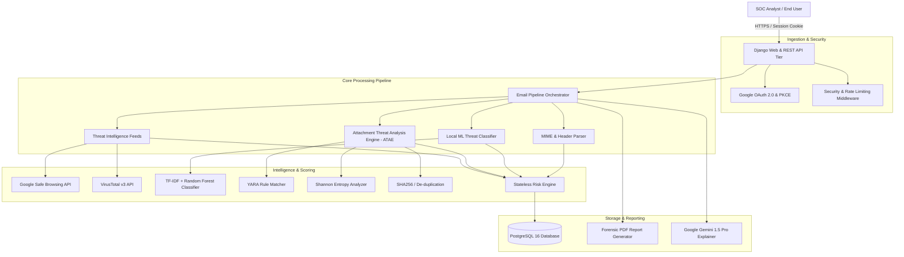
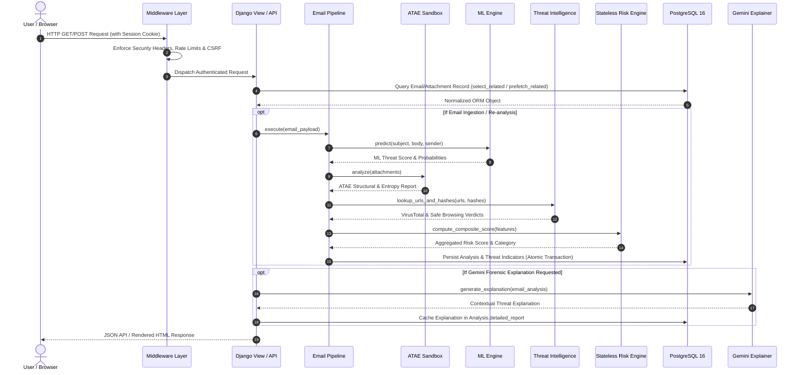
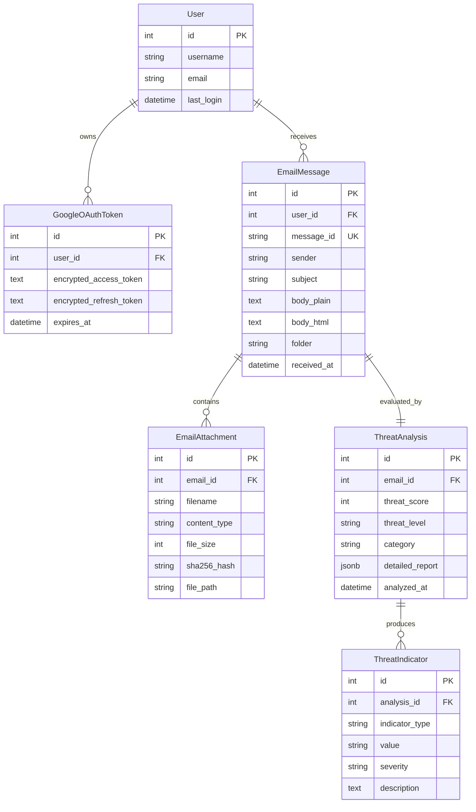

# SecuraMail Architecture Specification (v1.0)

## 1. Executive Summary

SecuraMail is an enterprise-grade AI email threat detection and digital forensics platform. It is designed to inspect inbound emails, analyze attachments via the Attachment Threat Analysis Engine (ATAE), evaluate threat indicators through local Machine Learning and external Threat Intelligence APIs (Google Safe Browsing, VirusTotal), and produce explainable forensic threat scores via a stateless Risk Engine and Google Gemini Pro 1.5.

The platform is built on Django 5.x, PostgreSQL 16, Google OAuth 2.0 with PKCE, ReportLab for forensic PDF compilation, and scikit-learn for local inference.

---

## 2. Complete System Architecture

### 2.1 High-Level Architecture Diagram



---

## 3. Low-Level Component Architecture

### 3.1 Request and Processing Lifecycle



---

## 4. Repository and Module Structure

```
/home/lonewolf/Email_Phisher/Email_Phisher/
|-- Email_Phisher/                # Django Project Core Configuration
|   |-- asgi.py                  # ASGI deployment gateway
|   |-- settings.py              # Application settings, middleware, database config
|   |-- urls.py                  # Root routing table
|   `-- wsgi.py                  # WSGI production server gateway
|-- SecureMail/                  # Primary Application Core
|   |-- api/                     # REST API views, endpoints, and serializers
|   |   |-- serializers.py       # DRF serializers with prefetch optimizations
|   |   `-- views.py             # REST API endpoint handlers
|   |-- management/              # Django management commands (sync, audit)
|   |-- middleware.py            # Custom security & rate-limiting middleware
|   |-- migrations/              # Database schema migrations
|   |-- ml/                      # Machine Learning inference engine
|   |   |-- model.joblib         # Trained classifier artifact
|   |   |-- predictor.py         # TF-IDF feature extraction & inference logic
|   |   `-- vectorizer.joblib    # Pre-fitted vocabulary matrix
|   |-- models.py                # Database models (User, Email, Attachment, Analysis, Indicators)
|   |-- services/                # Business logic services
|   |   |-- atae/                # Attachment Threat Analysis Engine
|   |   |   |-- engine.py        # Core ATAE orchestrator
|   |   |   |-- parsers.py       # File format & header parsers
|   |   |   |-- rules.py         # YARA and heuristic rule definitions
|   |   |   `-- scoring.py       # Attachment risk evaluator
|   |   |-- email_pipeline.py    # Main email security pipeline orchestrator
|   |   |-- forensic_pdf.py      # ReportLab PDF report compiler
|   |   |-- gemini_service.py    # Google Gemini 1.5 Pro API integration
|   |   |-- gmail_service.py     # Google OAuth 2.0 & Gmail REST synchronization
|   |   |-- risk_engine.py       # Stateless risk evaluation engine
|   |   |-- safe_browsing.py     # Google Safe Browsing v4 threat lookup
|   |   `-- virustotal.py        # VirusTotal v3 hash & URL intelligence
|   |-- templates/               # Server-rendered HTML templates (Inbox, Details, Reports)
|   |-- tests.py                 # Core unit and integration test suite
|   |-- urls.py                  # Application route definitions
|   `-- views.py                 # View controller logic
|-- load_tests/                  # Complete Locust Load Testing Framework
|   |-- config.py                # Test environment & SLA definitions
|   |-- personas/                # Virtual user personas (Mixed, Analyst, Normal, Anon)
|   `-- utils/                   # HTTP client, error classifier, telemetry monitors
|-- locustfile.py                # Master Locust load test entrypoint
|-- manage.py                    # Django management script
`-- requirements.txt             # Project runtime dependencies
```

---

## 5. Subsystem Design & Specifications

### 5.1 Google OAuth 2.0 Authentication Flow
1. **Authorization Initiation**: Generates a cryptographically secure random `state` and PKCE `code_verifier` / `code_challenge` pair.
2. **Google Redirection**: Directs user to Google OAuth consent screen with scopes: `openid`, `email`, `profile`, `https://www.googleapis.com/auth/gmail.readonly`.
3. **Callback & Exchange**: Receives authorization code, validates `state`, and exchanges token via `POST https://oauth2.googleapis.com/token`.
4. **Token Encryption**: Access and refresh tokens are encrypted via AES-256 before storage in `GoogleOAuthToken`. Plaintext tokens never touch the database.

### 5.2 Attachment Threat Analysis Engine (ATAE)
ATAE inspects files without relying on native execution:
- **Magic Number Validation**: Validates file headers against declared MIME types to detect spoofed extensions (e.g. `.exe` disguised as `.pdf`).
- **Shannon Entropy Analysis**: Computes entropy per byte block. Values $> 7.2$ indicate packing, compression, or encryption.
- **Embedded Object Inspection**: Parses OLE2 streams in Microsoft Office documents (`vbaProject.bin`) and JavaScript / ActionScript streams in PDFs.
- **YARA Signature Matching**: Matches byte sequences against signatures for known exploit kits, shellcode headers, and macro droppers.

### 5.3 Machine Learning Pipeline
- **Vectorization**: Sublinear TF-IDF vectorizer extracts unigrams and bigrams from subject and normalized message bodies.
- **Model**: Multi-class ensemble model (Random Forest / LightGBM) classifying samples into `SAFE`, `PHISHING`, `SUSPICIOUS`, or `MALWARE_DELIVERY`.
- **Latency Guarantee**: Model inference executes locally in memory with sub-5ms CPU latency per email.

### 5.4 Stateless Risk Engine
The [RiskEngine](file:///home/lonewolf/Email_Phisher/Email_Phisher/SecureMail/services/risk_engine.py) computes a deterministic composite score ($0 \le S \le 100$):

$$S = w_{\text{ML}} \cdot S_{\text{ML}} + w_{\text{ATAE}} \cdot S_{\text{ATAE}} + w_{\text{Intel}} \cdot S_{\text{Intel}} + w_{\text{Auth}} \cdot S_{\text{Auth}}$$

Where weights are defined as:
- $w_{\text{ML}} = 0.35$ (Body & Subject semantics)
- $w_{\text{ATAE}} = 0.30$ (Attachment threat score)
- $w_{\text{Intel}} = 0.25$ (VirusTotal & Safe Browsing detections)
- $w_{\text{Auth}} = 0.10$ (SPF, DKIM, and DMARC alignment status)

---

## 6. Database Design & Entity Relationships



---

## 7. Scalability & Concurrency Strategy

1. **Database Query Efficiency**: All views query through `select_related("analysis")` and `prefetch_related("indicators")`, preventing $N+1$ query overhead.
2. **Stateless Business Logic**: Services and risk evaluators store no mutable instance state, enabling horizontal scaling across multiple Gunicorn / Uvicorn worker processes.
3. **Result Caching**: External threat intel verdicts and LLM explanations are cached in PostgreSQL JSONB fields, eliminating redundant outbound API calls.
4. **Database Connection Pooling**: PostgreSQL maintains persistent connection pools configured for concurrent worker throughput.
