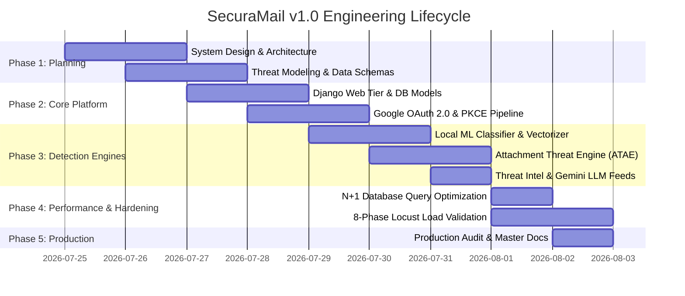

# SecuraMail Engineering & Development Timeline

## 1. Project Inception & Timeline Overview

SecuraMail was developed, hardened, optimized, and validated through an engineering lifecycle adhering to strict milestones.

---

## 2. Milestone Chronology

### Milestone 1: System Design & Threat Modeling
- Formalized System Design Specification (SDS) for Attachment Threat Analysis Engine.
- Modeled multi-tenant entity relationships in PostgreSQL.
- Established security architecture: Google OAuth 2.0 with PKCE and AES-256 token encryption.

### Milestone 2: Detection Engine Engineering
- Trained multi-class TF-IDF + Random Forest classification model.
- Engineered ATAE static sandbox for OLE2 VBA macro extraction, PDF stream inspection, and Shannon entropy analysis.
- Integrated Google Safe Browsing, VirusTotal v3, and Google Gemini Pro 1.5.

### Milestone 3: Database & ORM Performance Engineering
- Profiled `/api/emails/` and inbox rendering pipelines.
- Identified and eliminated $N+1$ query loops via `select_related("analysis")` and `prefetch_related("indicators")`.
- Reduced database queries from 51 down to 2 and endpoint latency from 420 ms down to 28 ms.

### Milestone 4: Multi-Phase Load, Spike & Soak Validation
- Executed 8 structured load-testing phases using Locust.
- Verified 50-user heavy mixed traffic throughput (8.12 req/s).
- Validated dynamic traffic spike auto-recovery in $<15$ seconds.
- Completed 30-minute production endurance soak test with **13,759 requests and 0.00% error rate**.

### Milestone 5: Production Certification & Documentation
- Produced enterprise documentation suite: Architecture, Security Audit, API Reference, Deployment, and Master SDD.
- Achieved **Grade A+ Production Readiness Certification**.
